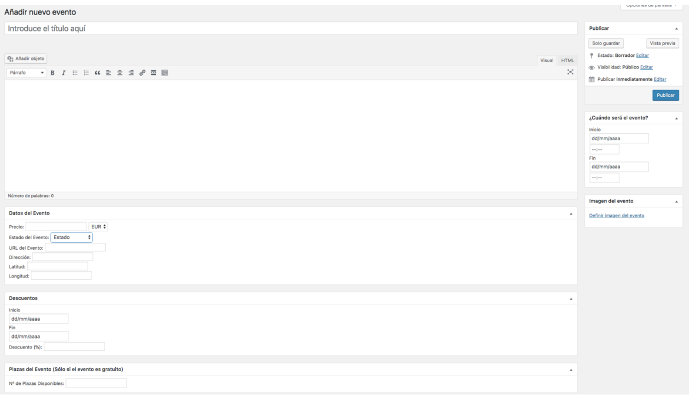
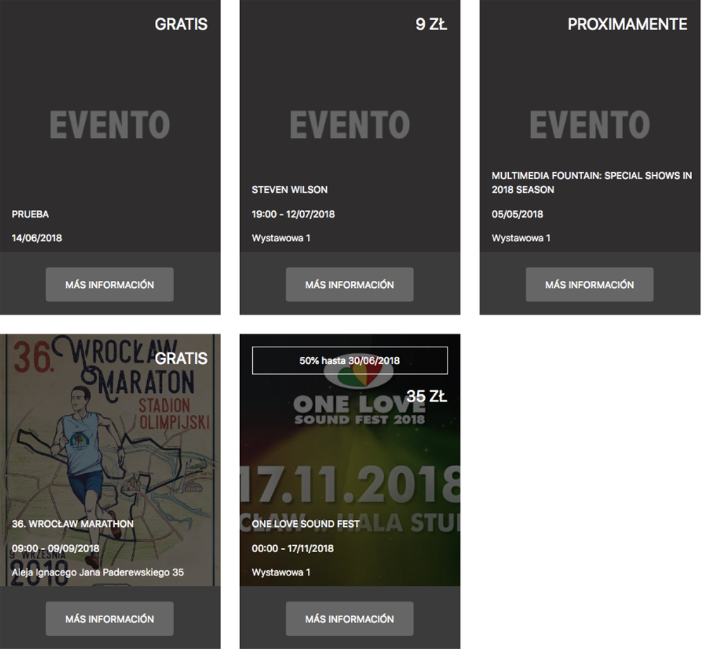
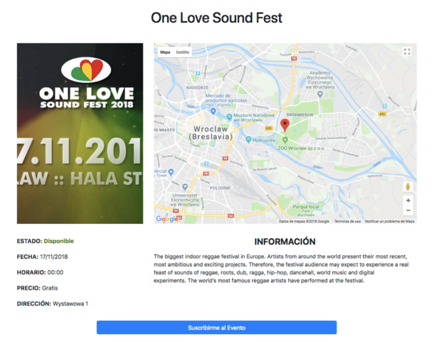
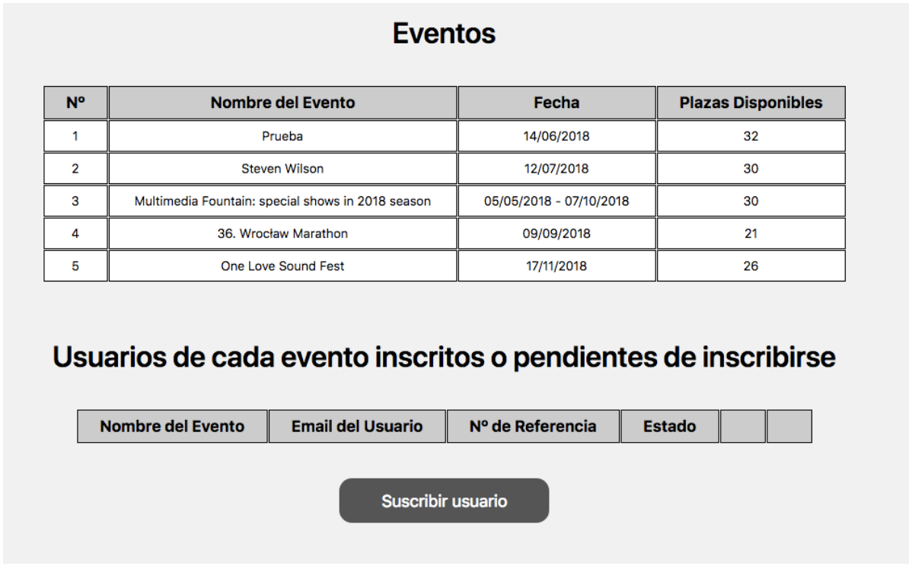
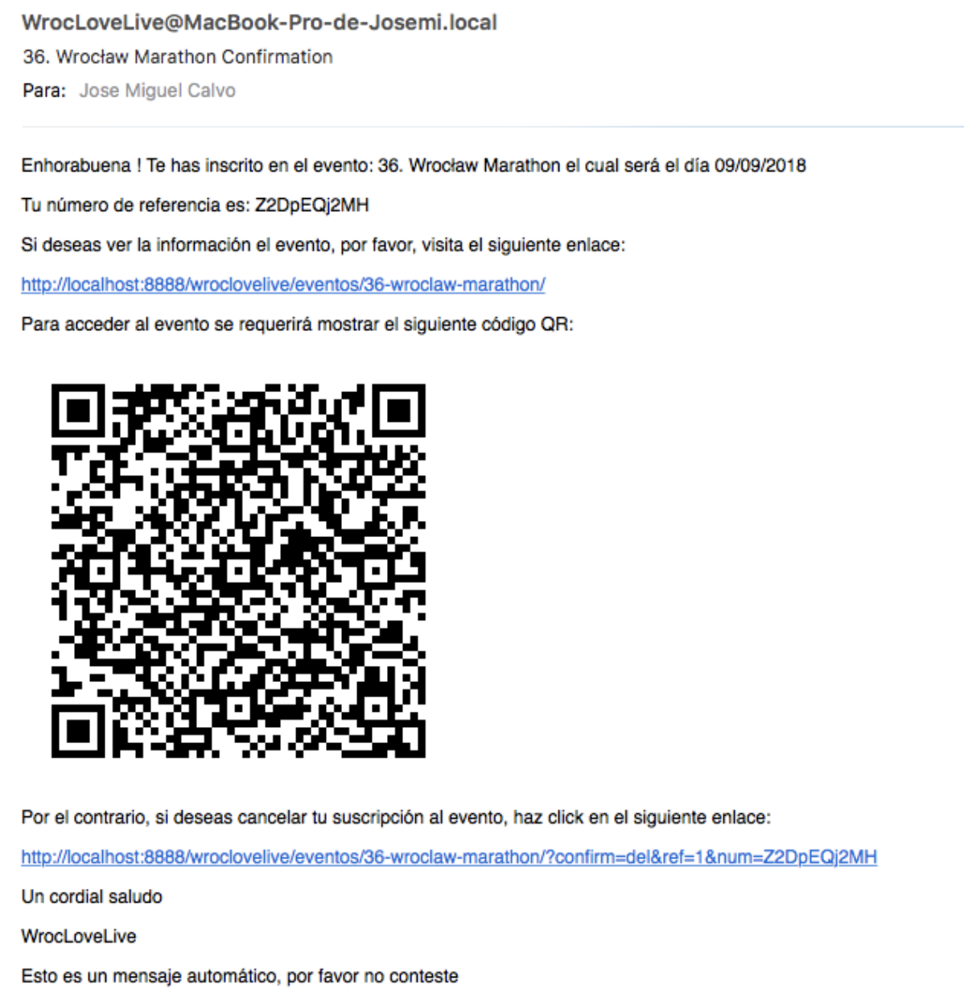

# Events Plugin

This is a Wordpress Plugin that allow us to create new events in the Wordpress panel page and display them.

## How to install the Plugin
--------------

1. Download the folder in this link: (https://github.com/joosemi1993/EventPlugin/archive/refs/heads/master.zip).
2. Unzip the file you have already downloaded.
3. Copy the folder to the Plugin folder of our Wordpress project (wordpress/wp-content/plugins).
4. Go to your wordpress admin page and go to Plugins section. Now you can see the plugin in the plugins list.
5. Finally you only have to click in the activate link.

## Design

### Create event

### Event list

### Event

### Admin panel

### Email

